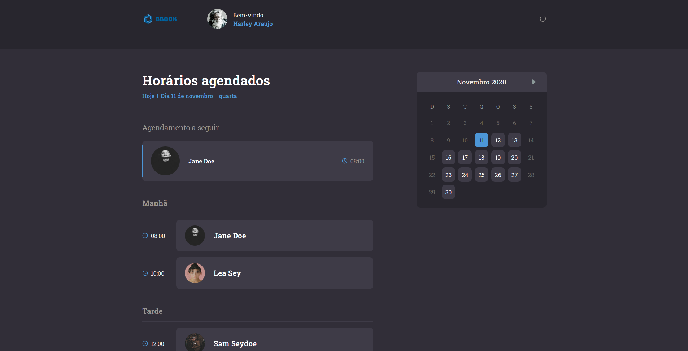
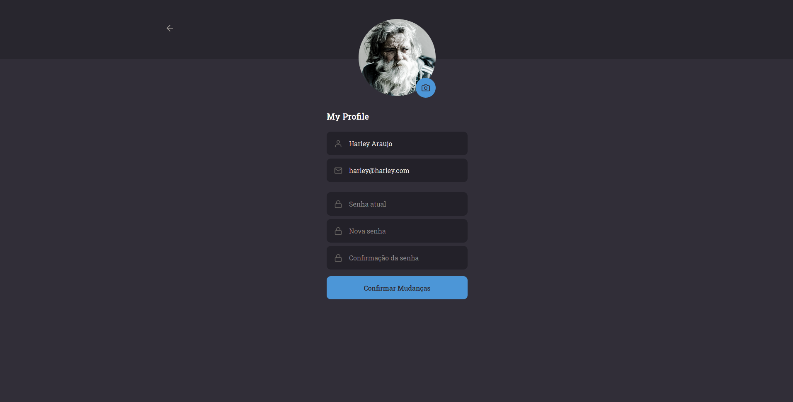

<h1 align="center">
     🗓️ BBook
</h1>

<h3 align="center">
    💻 Your Scheduling platform for service providers. ❤️
</h3>

<p align="center">
    
   
   
</p>


<h4 align="center"> 
	 Status: Finished
</h4>

<p align="center">
 <a href="#about">About</a> •
 <a href="#layout">Layout</a> • 
 <a href="#how-it-works">How it works</a> • 
 <a href="#tech-stack">Tech Stack</a> • 

</p>


## About

🗓️ BBook - is a  platform where the client can view the service provider schedule and schedule a time, and for service provider, it allows to manage the scheduled times.

With the web version, service provider will be able to manage their schedule by controlling the times that have been set by customers through the mobile version.

---

## Layout


### Mobile

  <p align="center">
  	
  </p>

### Web

<p align="center">
  
 

 

 <br>
  
 
 
 
</p>

---

## How it works

This project is divided into three parts:
1. Backend (server folder)
2. Frontend (web folder)
3. Mobile (mobile folder)

Both Frontend and Mobile need the Backend to be running to work.

### Pre-requisites

Before you begin, you will need to have the following tools installed on your machine:
[Git] (https://git-scm.com), [Node.js] (https://nodejs.org/en/).
In addition, it is good to have an editor to work with the code like [VSCode] (https://code.visualstudio.com/)

#### Runing the Backend (server)

```bash

# Clone this repository
$ git clone git@github.com:lildix/bbook.git

# Access the project folder in your terminal
$ cd bbook

# go to the server folder
$ cd backend

# install the dependencies
$ yarn

# Run the application in development mode
$ yarn dev:server

# The server will start at port: 3333 - go to http://localhost:3333

```


#### Running the web application (Frontend)

```bash

# Clone this repository
$ git clone git@github.com:lildix/bbook.git

# Access the project folder in your terminal
$ cd bbook

# Go to the Front End application folder
$ cd bbook-web

# Install the dependencies
$ yarn

# Run the application in development mode
$ yarn start

# The application will open on the port: 3000 - go to http://localhost:3000

```

#### Running the app (Mobile)

```bash

# Clone this repository
$ git clone git@github.com:lildix/bbook.git

# Access the project folder in your terminal
$ cd bbook

# Go to the Front End application folder
$ cd appbbook

# Install the dependencies
$ yarn

# Run the application 
$ npx react-native start

# With your emulator on run the builder
npx react-native run-android

or

npx react-native run-ios

```

---

## Tech Stack

The following tools were used in the construction of the project:

#### **Website**  ([React](https://reactjs.org/)  +  [TypeScript](https://www.typescriptlang.org/))

-   **[React Router Dom](https://github.com/ReactTraining/react-router/tree/main/packages/react-router-dom)**
-   **[React Icons](https://react-icons.github.io/react-icons/)**
-   **[Axios](https://github.com/axios/axios)**
-   **[Jest](https://github.com/facebook/jest)**
-   **[Date-fns](https://github.com/date-fns/date-fns)**
-   **[polished](https://react-day-picker.js.org/)**
-   **[react-day-picker](https://react-day-picker.js.org/)**
-   **[styled-components](https://styled-components.com)**
-   **[uuidv4](https://github.com/thenativeweb/uuidv4)**
-   **[yup](https://github.com/jquense/yup)**

> See the file  [package.json](https://github.com/lildix/bbook/blob/mainbb-web/package.json)

####  **Server**  ([NodeJS](https://nodejs.org/en/)  +  [TypeScript](https://www.typescriptlang.org/))

-   **[Express](https://expressjs.com/)**
-   **[CORS](https://expressjs.com/en/resources/middleware/cors.html)**
-   **[ts-node](https://github.com/TypeStrong/ts-node)**
-   **[dotENV](https://github.com/motdotla/dotenv)**
-   **[Multer](https://github.com/expressjs/multer)**
-   **[Joi](https://github.com/hapijs/joi)**
-   **[aws-sdk](https://github.com/aws/aws-sdk-js)**
-   **[bcryptjs](https://github.com/dcodeIO/bcrypt.js)**
-   **[celebrate](https://github.com/arb/celebrate)**
-   **[class-transformer](https://github.com/typestack/class-transformer)**
-   **[date-fns](https://github.com/date-fns/date-fns)**
-   **[handlebars](http://www.handlebarsjs.com/)**
-   **[ioredis](https://github.com/luin/ioredis)**
-   **[jsonwebtoken](https://github.com/auth0/node-jsonwebtoken)**
-   **[mime](https://github.com/broofa/mime)**
-   **[mongodb](https://github.com/mongodb/node-mongodb-native)**
-   **[nodemailer](https://nodemailer.com/)**
-   **[pg](https://github.com/brianc/node-postgres)**
-   **[rate-limiter-flexible](https://github.com/animir/node-rate-limiter-flexible)**
-   **[redis](https://github.com/NodeRedis/node-redis)**
-   **[tsyringe](https://github.com/Microsoft/tsyringe)**
-   **[typeorm](https://github.com/typeorm/typeorm)**
-   **[uuidv4](https://github.com/thenativeweb/uuidv4)**
 

> See the file  [package.json](https://github.com/lildix/bbook/blob/main/backend/package.json)

#### **Mobile**  ([React Native](http://www.reactnative.com/)  +  [TypeScript](https://www.typescriptlang.org/))

-   **[React Navigation](https://reactnavigation.org/)**
-   **[Axios](https://github.com/axios/axios)**
-   **[yup](https://github.com/jquense/yup)**
-   **[date-fns](https://github.com/date-fns/date-fns#readme)**
-   **[react-native-image-picker](https://github.com/react-community/react-native-image-picker)**
-   **[react-native-vector-icons](https://github.com/oblador/react-native-vector-icons)**


> See the file  [package.json](https://github.com/lildix/bbook/blob/main/appbbook/package.json)


---


## How to contribute

1. Fork the project.
2. Create a new branch with your changes: `git checkout -b my-feature`
3. Save your changes and create a commit message telling you what you did: `git commit -m" feature: My new feature "`
4. Submit your changes: `git push origin my-feature`

---

## License

This project is under the license [MIT](./LICENSE).

Made by Harley Araujo